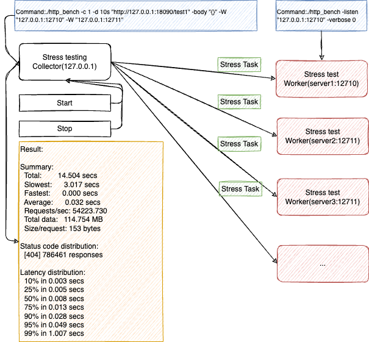

# a HTTP(HTTP/1, HTTP/2, HTTP/3, Websocket, gRPC) stress testing tool, and support single and distributed.

[](https://github.com/linkxzhou/http_bench/actions/workflows/build1.20.yml)
[](https://github.com/linkxzhou/http_bench/actions/workflows/build1.21.yml)
[](https://github.com/linkxzhou/http_bench/actions/workflows/build1.22.yml)

http_bench is a tiny program that sends some load to a web application, support single and distributed mechine, http/1, http/2, http/3, websocket, grpc.

[English Document](https://github.com/linkxzhou/http_bench/blob/master/README.md)     
[中文文档](https://github.com/linkxzhou/http_bench/blob/master/README_CN.md)    
[Example](https://github.com/linkxzhou/http_bench/blob/master/EXAMPLE.md)    

- [x] HTTP/1 stress testing
- [x] HTTP/2 stress testing
- [x] HTTP/3 stress testing
- [x] Websocket stress testing
- [x] Distributed stress testing
- [x] Support functions
- [x] Support variable 
- [x] Dashboard
- [ ] Stepping stress testing
- [ ] gRPC stress testing


## Installation

**NOTICE：go version >= 1.20**

```
go get github.com/linkxzhou/http_bench
```
OR
```
git clone git@github.com:linkxzhou/http_bench.git
cd http_bench
go build .
```

## Architecture


## Example Usage

[Example](./EXAMPLE.md)   

### Single URL Testing

```bash
# Basic GET request with 1000 requests and 10 concurrent connections
./http_bench -n 1000 -c 10 -m GET -url "http://127.0.0.1/test1"
./http_bench -n 1000 -c 10 -m GET "http://127.0.0.1/test1"
```

### Testing with .http File (Multiple Requests)

```bash
# Run benchmark using requests from a .http file
./http_bench -n 1000 -c 10 -file requests.http

# Combine with duration parameter
./http_bench -d 10s -c 10 -file requests.http
```

### HTTP/2 Testing

```bash
./http_bench -d 10s -c 10 -http http2 -m POST "http://127.0.0.1/test1" -body "{}"
```

### HTTP/3 Testing

```bash
./http_bench -d 10s -c 10 -http http3 -m POST "http://127.0.0.1/test1" -body "{}"
```

### WebSocket Testing

```bash
./http_bench -d 10s -c 10 -http ws "ws://127.0.0.1" -body "{}"
```

### Distributed Stress Testing

```bash
# Step 1: Start worker instances on different machines
./http_bench -listen "127.0.0.1:12710" -verbose 1
./http_bench -listen "127.0.0.1:12711" -verbose 1

# Step 2: Run the controller to coordinate the test
./http_bench -c 1 -d 10s "http://127.0.0.1:18090/test1" -body "{}" -W "127.0.0.1:12710" -W "127.0.0.1:12711" -verbose 1
```

### Web Dashboard

```bash
# Step 1: Start the dashboard server
./http_bench -listen "127.0.0.1:12345" -verbose 1

# Step 2: Open the dashboard URL in your browser
# http://127.0.0.1:12345
```

## Template Functions and Variables

HTTP Bench supports dynamic request generation using template functions. These can be used in both URL parameters and request bodies.

### 1. Integer Sum

Calculates the sum of multiple integers.

```bash
# URL parameter
./http_bench -c 1 -n 1 "https://127.0.0.1:18090?data={{ intSum 1 2 3 4}}" -verbose 0

# Request body
./http_bench -c 1 -n 1 "https://127.0.0.1:18090" -body "data={{ intSum 1 2 3 4 }}" -verbose 0
```

### 2. Random Integer

Generates a random integer between min and max values.

```bash
# URL parameter
./http_bench -c 1 -n 1 "https://127.0.0.1:18090?data={{ random 1 100000}}" -verbose 0

# Request body
./http_bench -c 1 -n 1 "https://127.0.0.1:18090" -body "data={{ random 1 100000 }}" -verbose 0
```

### 3. Random Date

Generates a random date string in the specified format.

```bash
# URL parameter
./http_bench -c 1 -n 1 "https://127.0.0.1:18090?data={{ randomDate 'YMD' }}" -verbose 0

# Request body
./http_bench -c 1 -n 1 "https://127.0.0.1:18090" -body "data={{ randomDate 'YMD' }}" -verbose 0
```

### 4. Random String

Generates a random alphanumeric string of specified length.

```bash
# URL parameter
./http_bench -c 1 -n 1 "https://127.0.0.1:18090?data={{ randomString 10}}" -verbose 0

# Request body
./http_bench -c 1 -n 1 "https://127.0.0.1:18090" -body "data={{ randomString 10 }}" -verbose 0
```

### 5. Random Number String

Generates a random numeric string of specified length.

```bash
# URL parameter
./http_bench -c 1 -n 1 "https://127.0.0.1:18090?data={{ randomNum 10}}" -verbose 0

# Request body
./http_bench -c 1 -n 1 "https://127.0.0.1:18090" -body "data={{ randomNum 10 }}" -verbose 0
```

### 6. Current Date

Outputs the current date in the specified format.

```bash
# URL parameter
./http_bench -c 1 -n 1 "https://127.0.0.1:18090?data={{ date 'YMD' }}" -verbose 0

# Request body
./http_bench -c 1 -n 1 "https://127.0.0.1:18090" -body "data={{ date 'YMD' }}" -verbose 0
```

### 7. UUID

Generates a UUID.

```bash
# URL parameter
./http_bench -c 1 -n 1 "https://127.0.0.1:18090?data={{ UUID | escape }}" -verbose 0

# Request body
./http_bench -c 1 -n 1 "https://127.0.0.1:18090" -body "data={{ UUID }}" -verbose 0
```

### 8. String Escape

Escapes special characters in a string.

```bash
# URL parameter
./http_bench -c 1 -n 1 "https://127.0.0.1:18090?data={{ UUID | escape }}" -verbose 0

# Request body
./http_bench -c 1 -n 1 "https://127.0.0.1:18090" -body "data={{ UUID | escape }}" -verbose 0
```

### 9. Hex to String

Converts a hexadecimal string to a regular string.

```bash
# URL parameter
./http_bench -c 1 -n 1 "https://127.0.0.1:18090?data={{ hexToString '68656c6c6f20776f726c64' }}" -verbose 0

# Request body
./http_bench -c 1 -n 1 "https://127.0.0.1:18090" -body "data={{ hexToString '68656c6c6f20776f726c64' }}" -verbose 0
```

### 10. String to Hex

Converts a string to its hexadecimal representation.

```bash
# URL parameter
./http_bench -c 1 -n 1 "https://127.0.0.1:18090?data={{ stringToHex 'hello world' }}" -verbose 0

# Request body
./http_bench -c 1 -n 1 "https://127.0.0.1:18090" -body "data={{ stringToHex 'hello world' }}" -verbose 0
```

### 11. To String

Converts a value to a quoted string.

```bash
# URL parameter
./http_bench -c 1 -n 1 "https://127.0.0.1:18090?data={{ randomNum 10 | toString }}" -verbose 0

# Request body
./http_bench -c 1 -n 1 "https://127.0.0.1:18090" -body "data={{ randomNum 10 | toString }}" -verbose 0
```

### 12. Base64 Encode

Encodes a string to Base64 format.

```bash
# URL parameter
./http_bench -c 1 -n 1 "https://127.0.0.1:18090?data={{ base64Encode 'hello world' }}" -verbose 0

# Request body
./http_bench -c 1 -n 1 "https://127.0.0.1:18090" -body "data={{ base64Encode 'hello world' }}" -verbose 0
```

### 13. Base64 Decode

Decodes a Base64 encoded string.

```bash
# URL parameter
./http_bench -c 1 -n 1 "https://127.0.0.1:18090?data={{ base64Decode 'aGVsbG8gd29ybGQ=' }}" -verbose 0

# Request body
./http_bench -c 1 -n 1 "https://127.0.0.1:18090" -body "data={{ base64Decode 'aGVsbG8gd29ybGQ=' }}" -verbose 0
```

### 14. MD5 Hash

Generates MD5 hash of a string.

```bash
# URL parameter
./http_bench -c 1 -n 1 "https://127.0.0.1:18090?data={{ md5 'hello world' }}" -verbose 0

# Request body
./http_bench -c 1 -n 1 "https://127.0.0.1:18090" -body "data={{ md5 'hello world' }}" -verbose 0
```

### 15. SHA1 Hash

Generates SHA1 hash of a string.

```bash
# URL parameter
./http_bench -c 1 -n 1 "https://127.0.0.1:18090?data={{ sha1 'hello world' }}" -verbose 0

# Request body
./http_bench -c 1 -n 1 "https://127.0.0.1:18090" -body "data={{ sha1 'hello world' }}" -verbose 0
```

### 16. SHA256 Hash

Generates SHA256 hash of a string.

```bash
# URL parameter
./http_bench -c 1 -n 1 "https://127.0.0.1:18090?data={{ sha256 'hello world' }}" -verbose 0

# Request body
./http_bench -c 1 -n 1 "https://127.0.0.1:18090" -body "data={{ sha256 'hello world' }}" -verbose 0
```

### 17. HMAC Signature

Generates HMAC signature with specified hash algorithm.

```bash
# URL parameter
./http_bench -c 1 -n 1 "https://127.0.0.1:18090?data={{ hmac 'secret_key' 'message' 'sha256' }}" -verbose 0

# Request body
./http_bench -c 1 -n 1 "https://127.0.0.1:18090" -body "data={{ hmac 'secret_key' 'message' 'sha256' }}" -verbose 0
```

### 18. Random IP Address

Generates a random IP address.

```bash
# URL parameter
./http_bench -c 1 -n 1 "https://127.0.0.1:18090?data={{ randomIP }}" -verbose 0

# Request body
./http_bench -c 1 -n 1 "https://127.0.0.1:18090" -body "data={{ randomIP }}" -verbose 0
```

### 19. Substring

Extracts a substring from a string.

```bash
# URL parameter
./http_bench -c 1 -n 1 "https://127.0.0.1:18090?data={{ substring 'hello world' 0 5 }}" -verbose 0

# Request body
./http_bench -c 1 -n 1 "https://127.0.0.1:18090" -body "data={{ substring 'hello world' 0 5 }}" -verbose 0
```

### 20. String Replace

Replaces all occurrences of a substring with another string.

```bash
# URL parameter
./http_bench -c 1 -n 1 "https://127.0.0.1:18090?data={{ replace 'hello world' 'world' 'golang' }}" -verbose 0

# Request body
./http_bench -c 1 -n 1 "https://127.0.0.1:18090" -body "data={{ replace 'hello world' 'world' 'golang' }}" -verbose 0
```

### 21. Uppercase

Converts a string to uppercase.

```bash
# URL parameter
./http_bench -c 1 -n 1 "https://127.0.0.1:18090?data={{ upper 'hello world' }}" -verbose 0

# Request body
./http_bench -c 1 -n 1 "https://127.0.0.1:18090" -body "data={{ upper 'hello world' }}" -verbose 0
```

### 22. Lowercase

Converts a string to lowercase.

```bash
# URL parameter
./http_bench -c 1 -n 1 "https://127.0.0.1:18090?data={{ lower 'HELLO WORLD' }}" -verbose 0

# Request body
./http_bench -c 1 -n 1 "https://127.0.0.1:18090" -body "data={{ lower 'HELLO WORLD' }}" -verbose 0
```

### 23. Trim Whitespace

Removes leading and trailing whitespace from a string.

```bash
# URL parameter
./http_bench -c 1 -n 1 "https://127.0.0.1:18090?data={{ trim '  hello world  ' }}" -verbose 0

# Request body
./http_bench -c 1 -n 1 "https://127.0.0.1:18090" -body "data={{ trim '  hello world  ' }}" -verbose 0
```

### 24. Random Choice

Randomly selects one item from multiple options.

```bash
# URL parameter
./http_bench -c 1 -n 1 "https://127.0.0.1:18090?data={{ randomChoice 'apple' 'banana' 'cherry' }}" -verbose 0

# Request body
./http_bench -c 1 -n 1 "https://127.0.0.1:18090" -body "data={{ randomChoice 'apple' 'banana' 'cherry' }}" -verbose 0
```

### 25. Random Float

Generates a random floating-point number between min and max values.

```bash
# URL parameter
./http_bench -c 1 -n 1 "https://127.0.0.1:18090?data={{ randomFloat 1.5 10.5 }}" -verbose 0

# Request body
./http_bench -c 1 -n 1 "https://127.0.0.1:18090" -body "data={{ randomFloat 1.5 10.5 }}" -verbose 0
```

### 26. Random Boolean

Generates a random boolean value (true or false).

```bash
# URL parameter
./http_bench -c 1 -n 1 "https://127.0.0.1:18090?data={{ randomBoolean }}" -verbose 0

# Request body
./http_bench -c 1 -n 1 "https://127.0.0.1:18090" -body "data={{ randomBoolean }}" -verbose 0
```

## Troubleshooting

### macOS Catalina Build Error

If you encounter the error `pointer is missing a nullability type specifier when building on catalina`, use the following workaround:

```bash
export CGO_CPPFLAGS="-Wno-error -Wno-nullability-completeness -Wno-expansion-to-defined"
```

## Contributing

Contributions are welcome! Feel free to open issues or submit pull requests.

## License

This project is licensed under the MIT License - see the LICENSE file for details.
